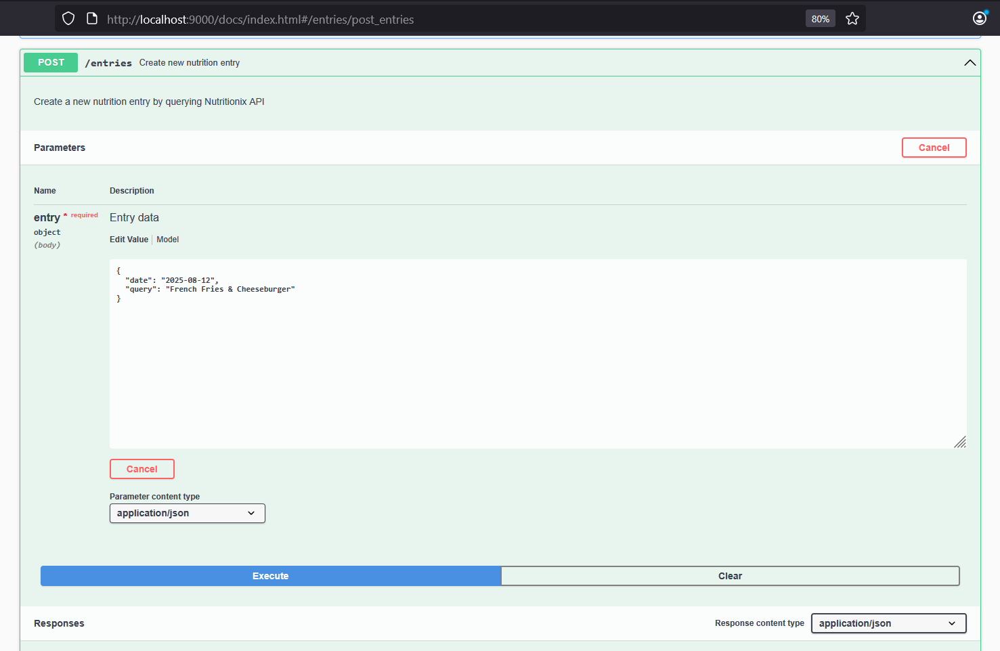
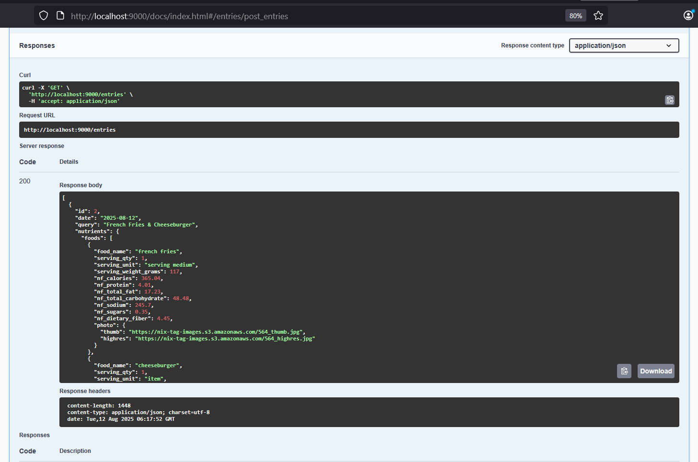
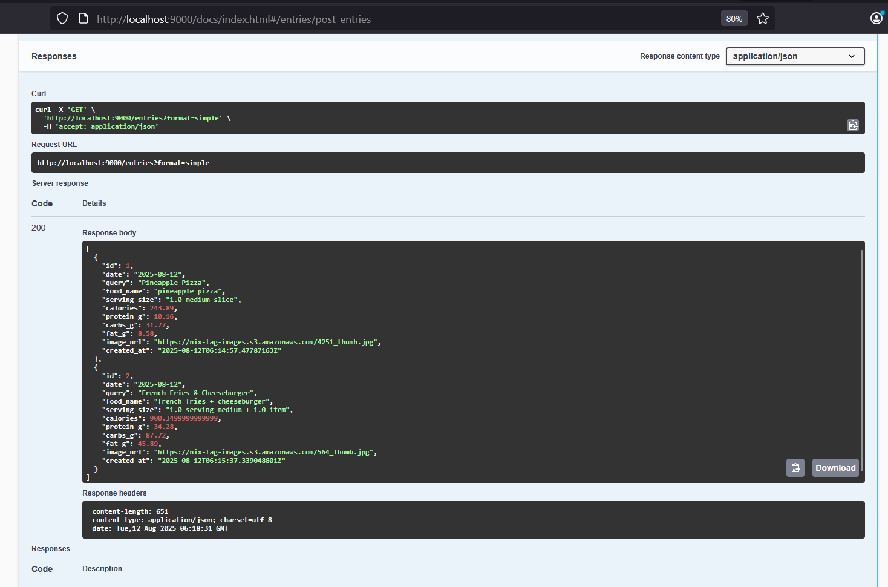
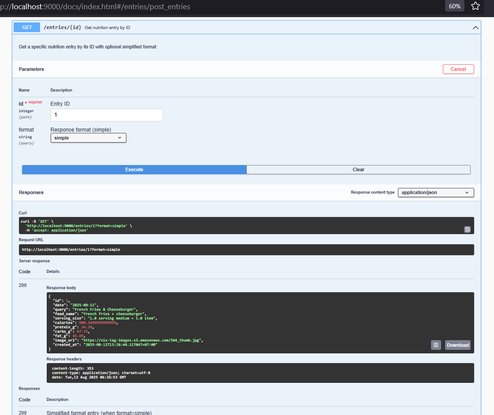
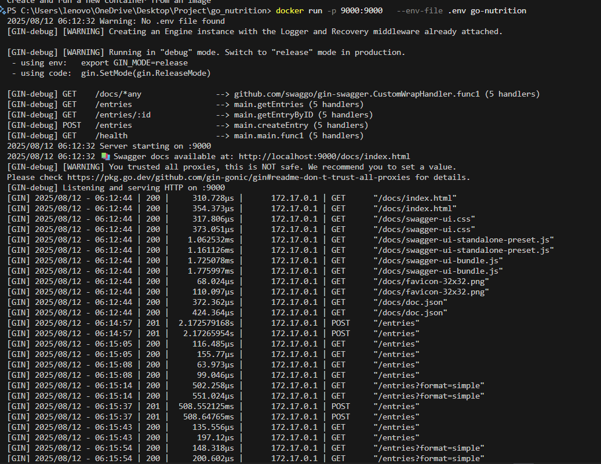

# Go Nutrition Tracker 🐹

API RESTful ringan yang dibangun dengan Go dan framework Gin untuk melacak asupan nutrisi. Aplikasi ini terintegrasi dengan Nutritionix API untuk memberikan informasi nutrisi yang akurat dari makanan yang dikonsumsi pengguna (USDA Database Foundation).

## Cara Penggunaan
Untuk mendapatkan data nutrisi yang tepat, gunakan nama makanan, buah, dan sayuran dalam bahasa Inggris karena aplikasi ini menggunakan database Nutritionix API (USDA).

**Contoh:** `apple`, `rice`, `fried chicken`, `2 bottle soda`, `beef kebab`

## 🌐 Fitur Utama

- **Pelacakan Nutrisi**: Buat dan kelola entry nutrisi dengan data lengkap (bukan dengan Brand)
- **Integrasi API**: Terintegrasi dengan Nutritionix API untuk data nutrisi akurat
- **Swagger Documentation**: API documentation interaktif
- **Docker Support**: Aplikasi dalam container untuk portable deployment

## 📋 API Endpoints

| Method | Endpoint | Deskripsi |
|--------|----------|-----------|
| GET | `/health` | Health check endpoint |
| GET | `/entries` | Ambil data seluruh nutrition entries |
| GET | `/entries/:id` | Ambil nutrition entry berdasarkan ID |
| POST | `/entries` | Buat nutrition entry baru |
| GET | `/docs/*any` | Swagger documentation |

**Query Parameters**: GET `/entries` mendukung `format=simple` untuk response yang disederhanakan.

## 🏗️ Tech Stack

- **Language**: Go 1.23.6
- **Framework**: Gin
- **API Documentation**: Swagger/OpenAPI 2.0
- **Container**: Docker & Alpine Linux

## 🛠️ Installation & Setup

### Prerequisites
- Go 1.23.6 atau lebih tinggi
- Docker (optional)
- Nutritionix API credentials (APP_ID dan APP_KEY)

### Local Development

1. **Clone repository**
   ```bash
   git clone <repository-url>
   cd go_nutrition
   ```

2. **Install dependencies**
   ```bash
   go mod download
   go install github.com/swaggo/swag/cmd/swag@v1.8.12
   ```

3. **Setup environment variables**
   Buat file `.env`:
   ```bash
   APP_ID=your_nutritionix_app_id
   APP_KEY=your_nutritionix_app_key
   ```

4. **Generate Swagger docs dan run aplikasi**
   ```bash
   swag init
   go run main.go
   ```

5. **Access aplikasi**
   - API: http://localhost:9000
   - Swagger: http://localhost:9000/docs/index.html

### Docker Deployment

```bash
# Build image
docker build -t go-nutrition .
```
```bash
# Run container
docker run -p 9000:9000 \
  -e APP_ID=your_nutritionix_app_id \
  -e APP_KEY=your_nutritionix_app_key \
  go-nutrition
```
#### Atau
```bash
# Run container
docker run -p 9000:9000 \
  --env-file .env \
  --name go-nutrition \
  go-nutrition
```

## 📖 Usage Examples (In-Memory Database)

### Create Nutrition Plan / Info Entry
```bash
curl -X POST http://localhost:9000/entries \
  -H "Content-Type: application/json" \
  -d '{
    "query": "1 cup rice",
    "date": "2025-08-11"
  }'
```

```bash
curl -X POST http://localhost:9000/entries \
  -H "Content-Type: application/json" \
  -d '{
    "query": "1 fried rice with 6 shrimp and 1 egg",
    "date": "2025-08-12"
  }'
```

### Get All Input Entries
```bash
# Full format
curl http://localhost:9000/entries

# Simple format
curl http://localhost:9000/entries?format=simple
```

### Health check
```bash
curl http://localhost:9000/health
```

## 🔧 Configuration

### Environment Variables
| Variable | Deskripsi | Required |
|----------|-----------|----------|
| `APP_ID` | Nutritionix API application ID | Ya |
| `APP_KEY` | Nutritionix API application key | Ya |
| `PORT` | Server port (default: 9000) | Tidak |

## 📊 API Response Examples

### Health Check Response
```json
{
  "status": "healthy",
  "entries": 5,
  "timestamp": "2025-08-11T10:00:00Z"
}
```

### Response Format Lengkap
```json
[{
  "id": 1,
  "date": "2025-08-12",
  "query": "1 plate of Nasi Goreng and 6 Shrimp",
  "nutrients": {
    "foods": [{
      "food_name": "nasi goreng",
      "serving_qty": 1,
      "serving_unit": "cup",
      "nf_calories": 274.38,
      "nf_protein": 12.29,
      "nf_total_carbohydrate": 36.34,
      "nf_total_fat": 8.43,
      "photo": {
        "thumb": "https://nix-tag-images.s3.amazonaws.com/4273_thumb.jpg"
      }
    }, {
      "food_name": "shrimp",
      "serving_qty": 6,
      "serving_unit": "shrimp",
      "nf_calories": 35.7,
      "nf_protein": 6.83,
      "nf_total_carbohydrate": 0.46,
      "nf_total_fat": 0.51
    }]
  },
  "created_at": "2025-08-12T10:14:36.3151853+07:00"
}]
```

### Response Format Simple (format=simple)
```json
[{
  "id": 1,
  "date": "2025-08-12",
  "query": "1 plate of Nasi Goreng and 6 Shrimp",
  "food_name": "nasi goreng + shrimp",
  "serving_size": "1.0 cup + 6.0 shrimp",
  "calories": 310.08,
  "protein_g": 19.12,
  "carbs_g": 36.8,
  "fat_g": 8.94,
  "image_url": "https://nix-tag-images.s3.amazonaws.com/4273_thumb.jpg",
  "created_at": "2025-08-12T10:14:36.3151853+07:00"
}]
```

## 📸 Application Demo


| Feature       | Demo |
|---------------|------|
| **Create an Entry** |  |
| **Get All Entries - Full** |  |
| **Get All Entries - Simple** |  |
| **Get Entry by ID** |  |
| **Docker Logs** |  |


---


## 🔍 Troubleshooting

### Common Issues

1. **Missing API Credentials**
   - Error: "missing required environment variables: APP_ID and APP_KEY"
   - Solution: Pastikan APP_ID dan APP_KEY sudah di-set

2. **Port Already in Use**
   - Error: "bind: address already in use"
   - Solution: Ganti port atau kill process yang menggunakan port 9000

3. **Docker Build Issues**
   - Solution: Pastikan Docker daemon running dan ada cukup disk space

## 📚 API Documentation

Interactive API documentation tersedia di:
- **Local**: http://localhost:9000/docs/index.html
